---

# **Solution Architecture Document**
## **AI-Powered Form Code Generation System**

**Version:** 1.0  
**Date:** December 2024  
**Status:** Draft

---

## **Table of Contents**

1. [Executive Summary](#1-executive-summary "1. Executive Summary")
2. [Business Context](#2-business-context "2. Business Context")
3. [Architectural Overview](#3-architectural-overview "3. Architectural Overview")
4. [Bounded Context Architecture](#4-bounded-context-architecture "4. Bounded Context Architecture")
5. [Technical Stack](#5-technical-stack "5. Technical Stack")
6. [Data Architecture](#6-data-architecture "6. Data Architecture")
7. [Integration Architecture](#7-integration-architecture)
8. [Security Architecture](#8-security-architecture)
9. [Deployment Architecture](#9-deployment-architecture)
10. [Non-Functional Requirements](#10-non-functional-requirements)
11. [Future Enhancements](#11-future-enhancements)

---

## **1. Executive Summary**

### **1.1 Purpose**
This document describes the architecture of an AI-powered system that automates the generation of production-ready code from PDF forms. The system leverages Claude AI to analyze form structures and generate complete application layers including C#, SQL, and React components.

### **1.2 Scope**
The system covers:
- PDF form upload and processing
- AI-powered code generation across multiple technologies
- Complete CRUD application scaffolding
- Testing infrastructure generation
- CI/CD pipeline generation
- Version control and comparison of generated code

### **1.3 Key Architectural Decisions**

| Decision                    | Rationale                                                            |
| --------------------------- | -------------------------------------------------------------------- |
| Domain-Driven Design (DDD)  | Clear separation of business domains, enabling independent evolution |
| Clean Architecture          | Dependency inversion, testability, and technology independence       |
| Bounded Contexts            | Loose coupling between Form, Import, and Code Generation domains     |
| Event-Driven Communication  | Asynchronous, scalable integration between contexts                  |
| Anthropic Claude API        | State-of-the-art document understanding and code generation          |
| Async/Background Processing | Handle variable generation times (seconds to minutes)                |

---

## **2. Business Context**

### **2.1 Business Problem**
Organizations spend significant time creating boilerplate CRUD applications from forms. This includes:
- Writing entity models
- Creating database schemas
- Building repositories and controllers
- Developing UI components
- Writing tests
- Setting up CI/CD pipelines

**Estimated time per form:** 8-40 hours of developer time

### **2.2 Business Solution**
Automate the entire process:
1. Upload PDF form
2. AI analyzes form structure
3. Generate complete application stack
4. Download production-ready code

**Estimated time with system:** 5-10 minutes

### **2.3 Business Benefits**
- **95% time reduction** in boilerplate code creation
- **Consistent code quality** through templates
- **Reduced human error** in scaffolding
- **Faster time-to-market** for new features
- **Developer focus** on business logic, not scaffolding

---

## **3. Architectural Overview**

### **3.1 System Context Diagram**

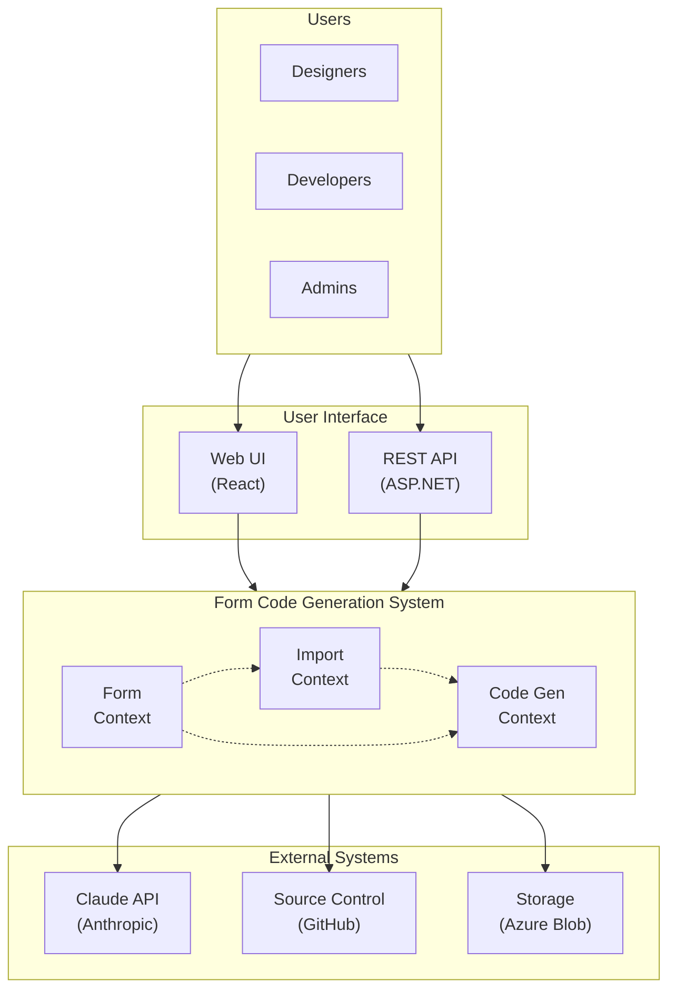
```mermaid
graph TB
subgraph External["External Systems"]
    Claude["Claude API<br/>(Anthropic)"]
    GitHub["Source Control<br/>(GitHub)"]
    Storage["Storage<br/>(Azure Blob)"]
end

subgraph System["Form Code Generation System"]
    FormCtx["Form<br/>Context"]
    ImportCtx["Import<br/>Context"]
    CodeGenCtx["Code Gen<br/>Context"]
end

subgraph Interface["User Interface"]
    WebUI["Web UI<br/>(React)"]
    API["REST API<br/>(ASP.NET)"]
end

subgraph Users["Users"]
    Designer["Designers"]
    Developer["Developers"]
    Admin["Admins"]
end

Users --> WebUI
Users --> API
WebUI --> System
API --> System

System --> Claude
System --> GitHub
System --> Storage

FormCtx -.-> ImportCtx
ImportCtx -.-> CodeGenCtx
FormCtx -.-> CodeGenCtx
```


### **3.2 High-Level Architecture**

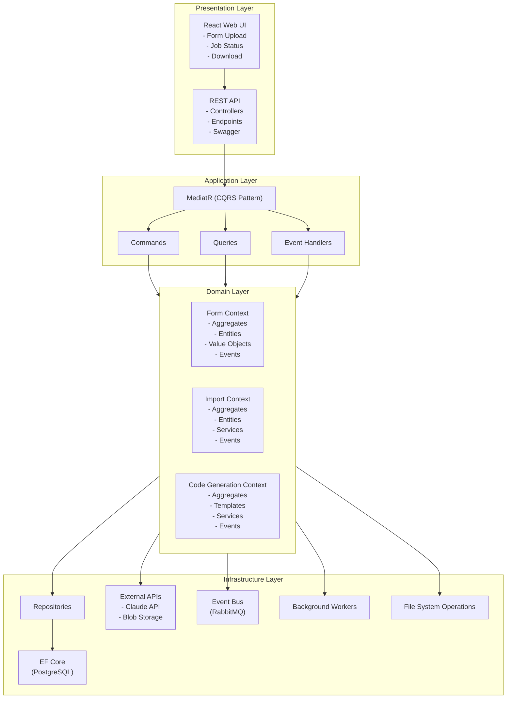
```mermaid
graph TB
    subgraph Presentation["Presentation Layer"]
        ReactUI["React Web UI<br/>- Form Upload<br/>- Job Status<br/>- Download"]
        RestAPI["REST API<br/>- Controllers<br/>- Endpoints<br/>- Swagger"]
    end
    
    subgraph Application["Application Layer"]
        CQRS["MediatR (CQRS Pattern)"]
        Commands["Commands"]
        Queries["Queries"]
        Events["Event Handlers"]
    end
    
    subgraph Domain["Domain Layer"]
        FormContext["Form Context<br/>- Aggregates<br/>- Entities<br/>- Value Objects<br/>- Events"]
        ImportContext["Import Context<br/>- Aggregates<br/>- Entities<br/>- Services<br/>- Events"]
        CodeGenContext["Code Generation Context<br/>- Aggregates<br/>- Templates<br/>- Services<br/>- Events"]
    end
    
    subgraph Infrastructure["Infrastructure Layer"]
        EFCore["EF Core<br/>(PostgreSQL)"]
        Repos["Repositories"]
        ExtAPIs["External APIs<br/>- Claude API<br/>- Blob Storage"]
        EventBus["Event Bus<br/>(RabbitMQ)"]
        Workers["Background Workers"]
        FileSystem["File System Operations"]
    end
    
    ReactUI --> RestAPI
    RestAPI --> CQRS
    CQRS --> Commands
    CQRS --> Queries
    CQRS --> Events
    
    Commands --> Domain
    Queries --> Domain
    Events --> Domain
    
    Domain --> Repos
    Domain --> ExtAPIs
    Domain --> EventBus
    Domain --> Workers
    Domain --> FileSystem
    
    Repos --> EFCore
```

---

## **4. Bounded Context Architecture**

### **4.1 Context Map**

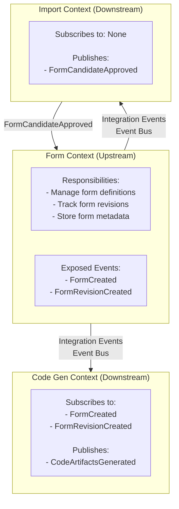
```mermaid
graph TB
    subgraph FormContext["Form Context (Upstream)"]
        FormResp["Responsibilities:<br/>- Manage form definitions<br/>- Track form revisions<br/>- Store form metadata"]
        FormEvents["Exposed Events:<br/>- FormCreated<br/>- FormRevisionCreated"]
    end
    
    subgraph ImportContext["Import Context (Downstream)"]
        ImportResp["Subscribes to: None<br/><br/>Publishes:<br/>- FormCandidateApproved"]
    end
    
    subgraph CodeGenContext["Code Gen Context (Downstream)"]
        CodeGenResp["Subscribes to:<br/>- FormCreated<br/>- FormRevisionCreated<br/><br/>Publishes:<br/>- CodeArtifactsGenerated"]
    end
    
    FormContext -->|Integration Events<br/>Event Bus| ImportContext
    FormContext -->|Integration Events<br/>Event Bus| CodeGenContext
    ImportContext -->|FormCandidateApproved| FormContext
```

### **4.2 Form Context - Detailed Architecture**

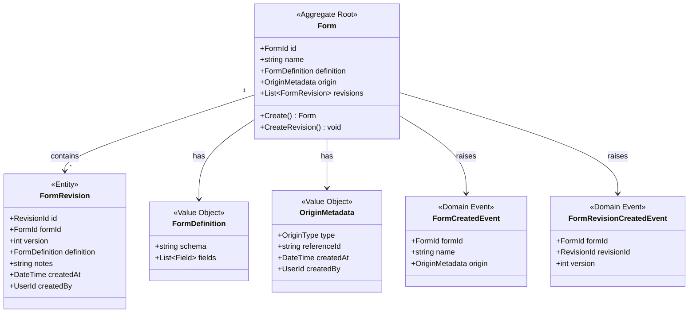
```mermaid
classDiagram
    class Form {
        <<Aggregate Root>>
        +FormId id
        +string name
        +FormDefinition definition
        +OriginMetadata origin
        +List~FormRevision~ revisions
        +Create() Form
        +CreateRevision() void
    }
    
    class FormRevision {
        <<Entity>>
        +RevisionId id
        +FormId formId
        +int version
        +FormDefinition definition
        +string notes
        +DateTime createdAt
        +UserId createdBy
    }
    
    class FormDefinition {
        <<Value Object>>
        +string schema
        +List~Field~ fields
    }
    
    class OriginMetadata {
        <<Value Object>>
        +OriginType type
        +string referenceId
        +DateTime createdAt
        +UserId createdBy
    }
    
    class FormCreatedEvent {
        <<Domain Event>>
        +FormId formId
        +string name
        +OriginMetadata origin
    }
    
    class FormRevisionCreatedEvent {
        <<Domain Event>>
        +FormId formId
        +RevisionId revisionId
        +int version
    }
    
    Form "1" --> "*" FormRevision : contains
    Form --> FormDefinition : has
    Form --> OriginMetadata : has
    Form --> FormCreatedEvent : raises
    Form --> FormRevisionCreatedEvent : raises
```

### **4.3 Form Import Context - Detailed Architecture**

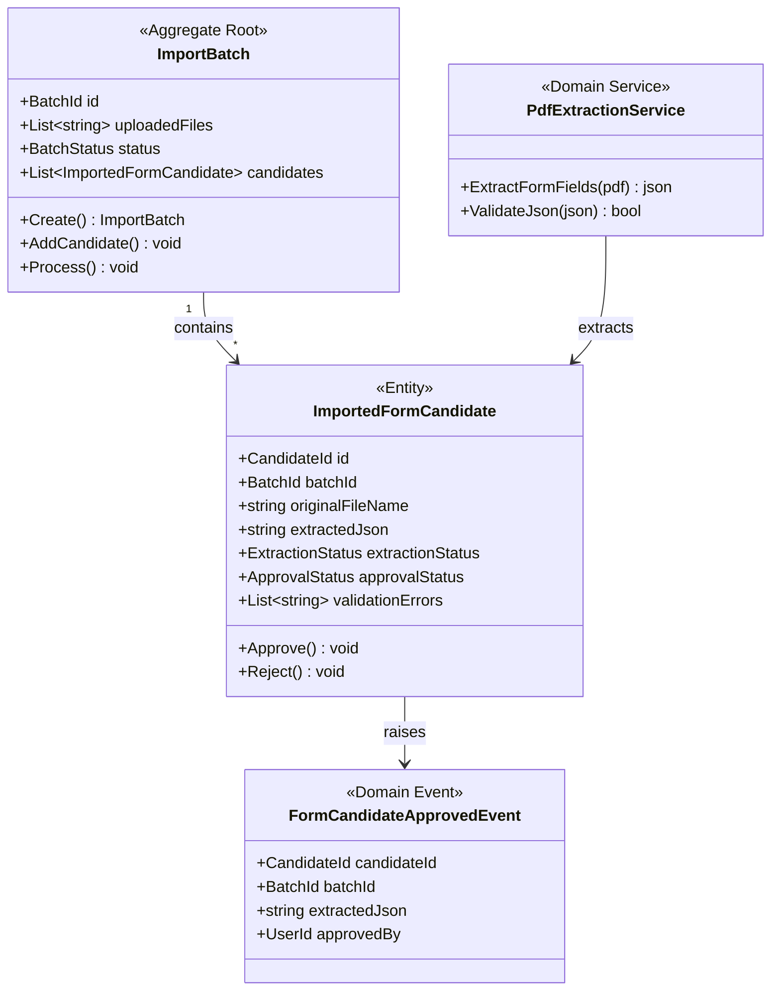
```mermaid
classDiagram
    class ImportBatch {
        <<Aggregate Root>>
        +BatchId id
        +List~string~ uploadedFiles
        +BatchStatus status
        +List~ImportedFormCandidate~ candidates
        +Create() ImportBatch
        +AddCandidate() void
        +Process() void
    }
    
    class ImportedFormCandidate {
        <<Entity>>
        +CandidateId id
        +BatchId batchId
        +string originalFileName
        +string extractedJson
        +ExtractionStatus extractionStatus
        +ApprovalStatus approvalStatus
        +List~string~ validationErrors
        +Approve() void
        +Reject() void
    }
    
    class PdfExtractionService {
        <<Domain Service>>
        +ExtractFormFields(pdf) json
        +ValidateJson(json) bool
    }
    
    class FormCandidateApprovedEvent {
        <<Domain Event>>
        +CandidateId candidateId
        +BatchId batchId
        +string extractedJson
        +UserId approvedBy
    }
    
    ImportBatch "1" --> "*" ImportedFormCandidate : contains
    PdfExtractionService --> ImportedFormCandidate : extracts
    ImportedFormCandidate --> FormCandidateApprovedEvent : raises
```

### **4.4 Code Generation Context - Detailed Architecture**

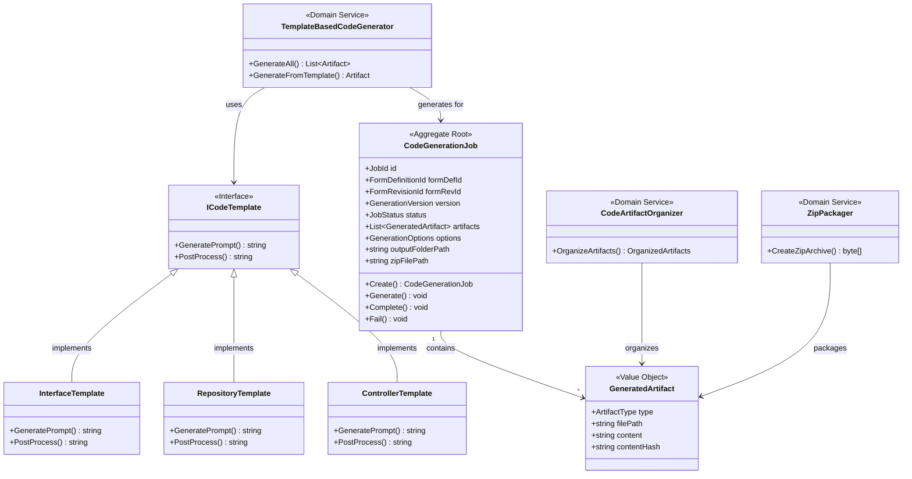
```mermaid
classDiagram
    class CodeGenerationJob {
        <<Aggregate Root>>
        +JobId id
        +FormDefinitionId formDefId
        +FormRevisionId formRevId
        +GenerationVersion version
        +JobStatus status
        +List~GeneratedArtifact~ artifacts
        +GenerationOptions options
        +string outputFolderPath
        +string zipFilePath
        +Create() CodeGenerationJob
        +Generate() void
        +Complete() void
        +Fail() void
    }
    
    class GeneratedArtifact {
        <<Value Object>>
        +ArtifactType type
        +string filePath
        +string content
        +string contentHash
    }
    
    class TemplateBasedCodeGenerator {
        <<Domain Service>>
        +GenerateAll() List~Artifact~
        +GenerateFromTemplate() Artifact
    }
    
    class ICodeTemplate {
        <<Interface>>
        +GeneratePrompt() string
        +PostProcess() string
    }
    
    class InterfaceTemplate {
        +GeneratePrompt() string
        +PostProcess() string
    }
    
    class RepositoryTemplate {
        +GeneratePrompt() string
        +PostProcess() string
    }
    
    class ControllerTemplate {
        +GeneratePrompt() string
        +PostProcess() string
    }
    
    class CodeArtifactOrganizer {
        <<Domain Service>>
        +OrganizeArtifacts() OrganizedArtifacts
    }
    
    class ZipPackager {
        <<Domain Service>>
        +CreateZipArchive() byte[]
    }
    
    CodeGenerationJob "1" --> "*" GeneratedArtifact : contains
    TemplateBasedCodeGenerator --> ICodeTemplate : uses
    ICodeTemplate <|-- InterfaceTemplate : implements
    ICodeTemplate <|-- RepositoryTemplate : implements
    ICodeTemplate <|-- ControllerTemplate : implements
    TemplateBasedCodeGenerator --> CodeGenerationJob : generates for
    CodeArtifactOrganizer --> GeneratedArtifact : organizes
    ZipPackager --> GeneratedArtifact : packages
```

### **4.5 Code Generation Process Flow**

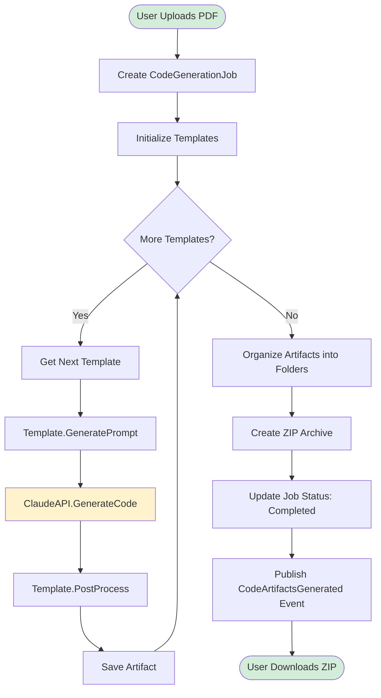
```mermaid
flowchart TD
    Start([User Uploads PDF]) --> CreateJob[Create CodeGenerationJob]
    CreateJob --> InitTemplates[Initialize Templates]
    
    InitTemplates --> LoopStart{More Templates?}
    LoopStart -->|Yes| GetTemplate[Get Next Template]
    GetTemplate --> GenPrompt[Template.GeneratePrompt]
    GenPrompt --> CallClaude[ClaudeAPI.GenerateCode]
    CallClaude --> PostProcess[Template.PostProcess]
    PostProcess --> SaveArtifact[Save Artifact]
    SaveArtifact --> LoopStart
    
    LoopStart -->|No| Organize[Organize Artifacts into Folders]
    Organize --> CreateZip[Create ZIP Archive]
    CreateZip --> UpdateJob[Update Job Status: Completed]
    UpdateJob --> PublishEvent[Publish CodeArtifactsGenerated Event]
    PublishEvent --> End([User Downloads ZIP])
    
    style Start fill:#d4edda
    style CallClaude fill:#fff3cd
    style End fill:#d4edda
```

---

## **5. Technical Stack**

### **5.1 Technology Matrix**

| Layer                 | Technology                    | Version | Purpose                      |
| --------------------- | ----------------------------- | ------- | ---------------------------- |
| **Backend Framework** | ASP.NET Core                  | 8.0     | Web API, DI, Configuration   |
| **Language**          | C\#                           | 12.0    | Primary development language |
| **ORM**               | Entity Framework Core         | 8.0     | Data access layer            |
| **Database**          | PostgreSQL                    | 15+     | Primary data store           |
| **Message Pattern**   | MediatR                       | 12.0    | CQRS implementation          |
| **Mapping**           | AutoMapper                    | 12.0    | DTO/Entity mapping           |
| **Validation**        | FluentValidation              | 11.0    | Input validation             |
| **Testing**           | xUnit                         | 2.6     | Unit & integration tests     |
| **Assertions**        | FluentAssertions              | 6.12    | Readable test assertions     |
| **Mocking**           | Moq                           | 4.20    | Test doubles                 |
| **API Documentation** | Swashbuckle/Swagger           | 6.5     | OpenAPI/Swagger docs         |
| **Logging**           | Serilog                       | 3.1     | Structured logging           |
| **Event Bus**         | RabbitMQ                      | 3.12    | Inter-context messaging      |
| **Blob Storage**      | Azure Blob Storage            | -       | Large file storage           |
| **AI Integration**    | Anthropic Claude API          | -       | PDF analysis & code gen      |
| **Frontend**          | React                         | 18.2    | (Generated code)             |
| **UI Framework**      | Bootstrap                     | 5.3     | (Generated code)             |
| **Container**         | Docker                        | 24.0    | Containerization             |
| **Orchestration**     | Kubernetes                    | 1.28    | Container orchestration      |
| **CI/CD**             | GitHub Actions / Azure DevOps | -       | Build & deployment           |

### **5.2 NuGet Packages**

```xml
<!-- Core Packages -->
<PackageReference Include="Microsoft.AspNetCore.OpenApi" Version="8.0.0" />
<PackageReference Include="Swashbuckle.AspNetCore" Version="6.5.0" />

<!-- Database -->
<PackageReference Include="Microsoft.EntityFrameworkCore" Version="8.0.0" />
<PackageReference Include="Microsoft.EntityFrameworkCore.Design" Version="8.0.0" />
<PackageReference Include="Npgsql.EntityFrameworkCore.PostgreSQL" Version="8.0.0" />

<!-- CQRS & Patterns -->
<PackageReference Include="MediatR" Version="12.2.0" />
<PackageReference Include="AutoMapper" Version="12.0.1" />
<PackageReference Include="AutoMapper.Extensions.Microsoft.DependencyInjection" Version="12.0.1" />
<PackageReference Include="FluentValidation.AspNetCore" Version="11.3.0" />

<!-- Logging -->
<PackageReference Include="Serilog.AspNetCore" Version="8.0.0" />
<PackageReference Include="Serilog.Sinks.Console" Version="5.0.0" />
<PackageReference Include="Serilog.Sinks.File" Version="5.0.0" />
<PackageReference Include="Serilog.Sinks.Seq" Version="6.0.0" />

<!-- Testing -->
<PackageReference Include="xunit" Version="2.6.0" />
<PackageReference Include="xunit.runner.visualstudio" Version="2.5.0" />
<PackageReference Include="FluentAssertions" Version="6.12.0" />
<PackageReference Include="Moq" Version="4.20.0" />
<PackageReference Include="Microsoft.AspNetCore.Mvc.Testing" Version="8.0.0" />
<PackageReference Include="Microsoft.EntityFrameworkCore.InMemory" Version="8.0.0" />

<!-- Azure Services -->
<PackageReference Include="Azure.Storage.Blobs" Version="12.19.0" />

<!-- RabbitMQ -->
<PackageReference Include="RabbitMQ.Client" Version="6.7.0" />
```

---

## **6. Data Architecture**

### **6.1 Database Schema - Form Context**

```sql
-- Forms Table
CREATE TABLE forms (
    id UUID PRIMARY KEY DEFAULT gen_random_uuid(),
    name VARCHAR(200) NOT NULL,
    definition JSONB NOT NULL,
    origin_type VARCHAR(50) NOT NULL,
    origin_reference_id VARCHAR(100),
    created_at TIMESTAMP NOT NULL DEFAULT NOW(),
    modified_at TIMESTAMP,
    created_by VARCHAR(100) NOT NULL,
    modified_by VARCHAR(100),
    is_deleted BOOLEAN NOT NULL DEFAULT FALSE
);

-- Form Revisions Table
CREATE TABLE form_revisions (
    id UUID PRIMARY KEY DEFAULT gen_random_uuid(),
    form_id UUID NOT NULL REFERENCES forms(id) ON DELETE CASCADE,
    version INT NOT NULL,
    definition JSONB NOT NULL,
    notes TEXT,
    created_at TIMESTAMP NOT NULL DEFAULT NOW(),
    created_by VARCHAR(100) NOT NULL,
    UNIQUE(form_id, version)
);

-- Indexes
CREATE INDEX idx_forms_created_at ON forms(created_at DESC);
CREATE INDEX idx_forms_is_deleted ON forms(is_deleted) INCLUDE (id, created_at);
CREATE INDEX idx_form_revisions_form_id ON form_revisions(form_id, version DESC);
```

### **6.2 Database Schema - Import Context**

```sql
-- Import Batches Table
CREATE TABLE import_batches (
    id UUID PRIMARY KEY DEFAULT gen_random_uuid(),
    status VARCHAR(50) NOT NULL,
    uploaded_files JSONB NOT NULL,
    created_at TIMESTAMP NOT NULL DEFAULT NOW(),
    created_by VARCHAR(100) NOT NULL,
    completed_at TIMESTAMP
);

-- Imported Form Candidates Table
CREATE TABLE imported_form_candidates (
    id UUID PRIMARY KEY DEFAULT gen_random_uuid(),
    batch_id UUID NOT NULL REFERENCES import_batches(id) ON DELETE CASCADE,
    original_file_name VARCHAR(255) NOT NULL,
    extracted_json JSONB,
    extraction_status VARCHAR(50) NOT NULL,
    approval_status VARCHAR(50) NOT NULL,
    validation_errors JSONB,
    created_at TIMESTAMP NOT NULL DEFAULT NOW(),
    approved_at TIMESTAMP,
    approved_by VARCHAR(100),
    rejected_at TIMESTAMP,
    rejected_by VARCHAR(100),
    rejection_reason TEXT
);

-- Indexes
CREATE INDEX idx_import_batches_status ON import_batches(status);
CREATE INDEX idx_import_batches_created_at ON import_batches(created_at DESC);
CREATE INDEX idx_candidates_batch_id ON imported_form_candidates(batch_id);
CREATE INDEX idx_candidates_status ON imported_form_candidates(approval_status);
```

### **6.3 Database Schema - Code Generation Context**

```sql
-- Code Generation Jobs Table
CREATE TABLE code_generation_jobs (
    id UUID PRIMARY KEY DEFAULT gen_random_uuid(),
    form_definition_id UUID NOT NULL,
    form_revision_id UUID NOT NULL,
    version VARCHAR(20) NOT NULL,
    status VARCHAR(50) NOT NULL,
    options JSONB NOT NULL,
    output_folder_path VARCHAR(500),
    zip_file_path VARCHAR(500),
    zip_file_size_bytes BIGINT,
    requested_at TIMESTAMP NOT NULL DEFAULT NOW(),
    requested_by VARCHAR(100) NOT NULL,
    completed_at TIMESTAMP,
    error_message TEXT
);

-- Generated Artifacts Table
CREATE TABLE generated_artifacts (
    id UUID PRIMARY KEY DEFAULT gen_random_uuid(),
    job_id UUID NOT NULL REFERENCES code_generation_jobs(id) ON DELETE CASCADE,
    artifact_type VARCHAR(50) NOT NULL,
    file_path VARCHAR(500) NOT NULL,
    content TEXT NOT NULL,
    content_hash VARCHAR(64) NOT NULL,
    size_bytes INT NOT NULL,
    generated_at TIMESTAMP NOT NULL DEFAULT NOW()
);

-- Indexes
CREATE INDEX idx_jobs_form_definition ON code_generation_jobs(form_definition_id, version DESC);
CREATE INDEX idx_jobs_status ON code_generation_jobs(status);
CREATE INDEX idx_jobs_requested_at ON code_generation_jobs(requested_at DESC);
CREATE INDEX idx_artifacts_job_id ON generated_artifacts(job_id);
CREATE INDEX idx_artifacts_type ON generated_artifacts(artifact_type);
```

### **6.4 Entity Relationship Diagram**

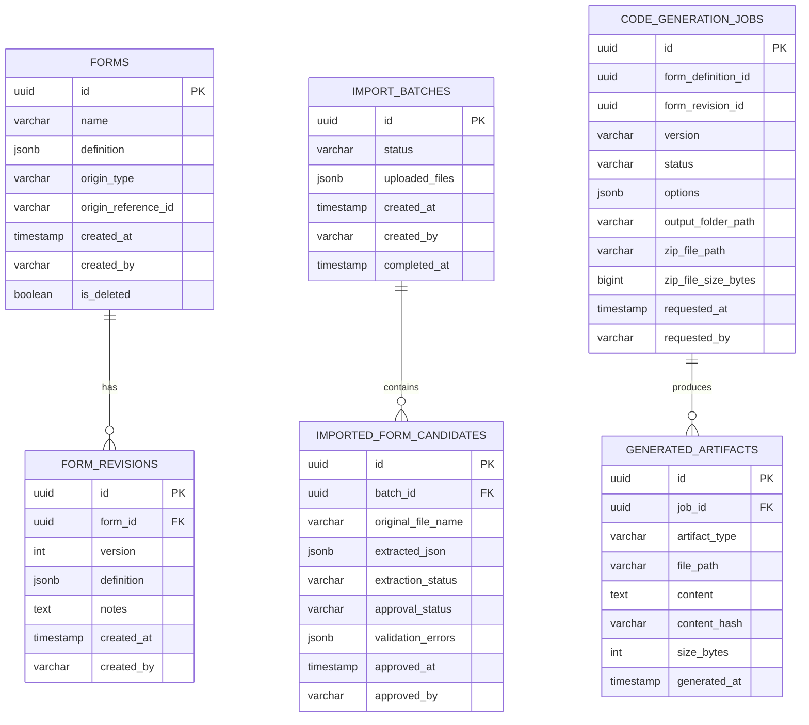
```mermaid
erDiagram
    FORMS ||--o{ FORM_REVISIONS : has
    IMPORT_BATCHES ||--o{ IMPORTED_FORM_CANDIDATES : contains
    CODE_GENERATION_JOBS ||--o{ GENERATED_ARTIFACTS : produces
    
    FORMS {
        uuid id PK
        varchar name
        jsonb definition
        varchar origin_type
        varchar origin_reference_id
        timestamp created_at
        varchar created_by
        boolean is_deleted
    }
    
    FORM_REVISIONS {
        uuid id PK
        uuid form_id FK
        int version
        jsonb definition
        text notes
        timestamp created_at
        varchar created_by
    }
    
    IMPORT_BATCHES {
        uuid id PK
        varchar status
        jsonb uploaded_files
        timestamp created_at
        varchar created_by
        timestamp completed_at
    }
    
    IMPORTED_FORM_CANDIDATES {
        uuid id PK
        uuid batch_id FK
        varchar original_file_name
        jsonb extracted_json
        varchar extraction_status
        varchar approval_status
        jsonb validation_errors
        timestamp approved_at
        varchar approved_by
    }
    
    CODE_GENERATION_JOBS {
        uuid id PK
        uuid form_definition_id
        uuid form_revision_id
        varchar version
        varchar status
        jsonb options
        varchar output_folder_path
        varchar zip_file_path
        bigint zip_file_size_bytes
        timestamp requested_at
        varchar requested_by
    }
    
    GENERATED_ARTIFACTS {
        uuid id PK
        uuid job_id FK
        varchar artifact_type
        varchar file_path
        text content
        varchar content_hash
        int size_bytes
        timestamp generated_at
    }
```

---

## **7. Integration Architecture**

### **7.1 Event-Driven Communication Flow**

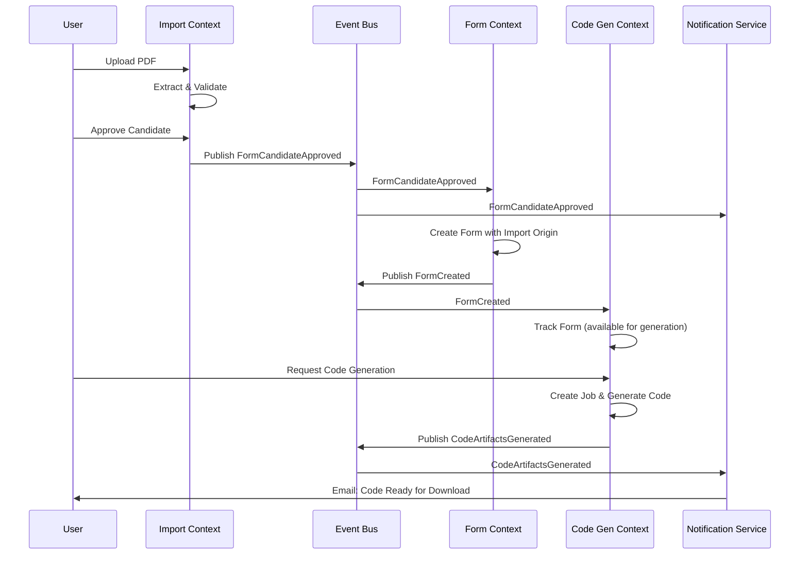
```mermaid
sequenceDiagram
    participant User
    participant ImportCtx as Import Context
    participant EventBus as Event Bus
    participant FormCtx as Form Context
    participant CodeGenCtx as Code Gen Context
    participant Notification as Notification Service
    
    User->>ImportCtx: Upload PDF
    ImportCtx->>ImportCtx: Extract & Validate
    User->>ImportCtx: Approve Candidate
    
    ImportCtx->>EventBus: Publish FormCandidateApproved
    
    EventBus->>FormCtx: FormCandidateApproved
    EventBus->>Notification: FormCandidateApproved
    
    FormCtx->>FormCtx: Create Form with Import Origin
    FormCtx->>EventBus: Publish FormCreated
    
    EventBus->>CodeGenCtx: FormCreated
    CodeGenCtx->>CodeGenCtx: Track Form (available for generation)
    
    User->>CodeGenCtx: Request Code Generation
    CodeGenCtx->>CodeGenCtx: Create Job & Generate Code
    CodeGenCtx->>EventBus: Publish CodeArtifactsGenerated
    
    EventBus->>Notification: CodeArtifactsGenerated
    Notification->>User: Email: Code Ready for Download
```

### **7.2 Integration with Claude API**

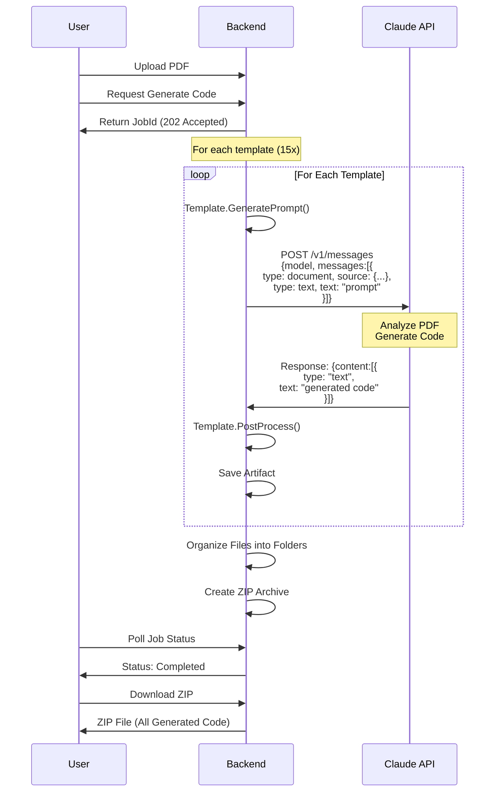
```mermaid
sequenceDiagram
    participant User
    participant Backend
    participant ClaudeAPI as Claude API
    
    User->>Backend: Upload PDF
    User->>Backend: Request Generate Code
    Backend->>User: Return JobId (202 Accepted)
    
    Note over Backend: For each template (15x)
    
    loop For Each Template
        Backend->>Backend: Template.GeneratePrompt()
        Backend->>ClaudeAPI: POST /v1/messages<br/>{model, messages:[{<br/>  type: document, source: {...},<br/>  type: text, text: "prompt"<br/>}]}
        
        Note over ClaudeAPI: Analyze PDF<br/>Generate Code
        
        ClaudeAPI->>Backend: Response: {content:[{<br/>  type: "text",<br/>  text: "generated code"<br/>}]}
        
        Backend->>Backend: Template.PostProcess()
        Backend->>Backend: Save Artifact
    end
    
    Backend->>Backend: Organize Files into Folders
    Backend->>Backend: Create ZIP Archive
    
    User->>Backend: Poll Job Status
    Backend->>User: Status: Completed
    
    User->>Backend: Download ZIP
    Backend->>User: ZIP File (All Generated Code)
```

### **7.3 API Endpoints**
#### **Form Context API**

```plaintext
GET    /api/forms                    # Get all forms
GET    /api/forms/{id}               # Get form by ID
POST   /api/forms                    # Create form
PUT    /api/forms/{id}               # Update form
DELETE /api/forms/{id}               # Delete form
GET    /api/forms/{id}/revisions     # Get form revisions
POST   /api/forms/{id}/revisions     # Create new revision
```

#### **Import Context API**

```plaintext
POST   /api/imports/batch            # Upload PDF batch
GET    /api/imports/batch/{id}       # Get batch status
GET    /api/imports/batch/{id}/candidates  # Get candidates
POST   /api/imports/candidates/{id}/approve  # Approve candidate
POST   /api/imports/candidates/{id}/reject   # Reject candidate
```

#### **Code Generation Context API**

```plaintext
POST   /api/code-generation/generate          # Start generation
GET    /api/code-generation/jobs/{id}/status  # Get job status
GET    /api/code-generation/jobs/{id}/download # Download ZIP
GET    /api/code-generation/jobs/{id}/files   # List generated files
GET    /api/code-generation/forms/{id}/history # Get generation history
GET    /api/code-generation/compare?job1={id1}&job2={id2} # Compare generations
```

---

## **8. Security Architecture**

### **8.1 Security Layers**


```mermaid
graph TB
    subgraph Layer1["Layer 1: Perimeter Security"]
        WAF["Web Application Firewall<br/>(WAF)"]
        DDoS["DDoS Protection"]
        RateLimit["Rate Limiting<br/>100 req/min per user"]
        IPWhitelist["IP Whitelisting<br/>(Optional)"]
    end
    
    subgraph Layer2["Layer 2: Authentication & Authorization"]
        JWT["JWT Bearer Tokens<br/>Expires: 1 hour"]
        OAuth["OAuth 2.0 /<br/>OpenID Connect"]
        RBAC["Role-Based Access Control<br/>- Admin<br/>- Developer<br/>- Designer<br/>- Viewer"]
        Claims["Claims-Based<br/>Authorization"]
    end
    
    subgraph Layer3["Layer 3: API Security"]
        HTTPS["HTTPS/TLS 1.3"]
        APIKey["API Key Authentication<br/>(Claude API)"]
        Validation["Request Validation<br/>& Input Sanitization"]
        CORS["CORS Policy"]
        SecHeaders["Security Headers<br/>- HSTS<br/>- CSP<br/>- X-Frame-Options"]
    end
    
    subgraph Layer4["Layer 4: Data Security"]
        EncryptRest["Encryption at Rest<br/>(Database)"]
        EncryptTransit["Encryption in Transit<br/>(TLS)"]
        DataMask["Sensitive Data Masking"]
        SecureFile["Secure File Storage<br/>(Azure Blob)"]
    end
    
    subgraph Layer5["Layer 5: Secrets Management"]
        KeyVault["Azure Key Vault /<br/>AWS Secrets Manager"]
        APIKeyStore["API Keys Stored Securely"]
        ConnString["Connection Strings<br/>Encrypted"]
        NoSecrets["No Secrets in<br/>Source Code"]
    end
    
    subgraph Layer6["Layer 6: Audit & Monitoring"]
        Logging["Comprehensive Logging<br/>(Serilog)"]
        SecEvent["Security Event<br/>Monitoring"]
        Anomaly["Anomaly Detection"]
        Compliance["Compliance Reporting"]
    end
    
    Internet[Internet Traffic] --> Layer1
    Layer1 --> Layer2
    Layer2 --> Layer3
    Layer3 --> Layer4
    Layer4 --> Layer5
    Layer5 --> Layer6
    Layer6 --> Application[Application<br/>Processing]
    
    style Layer1 fill:#ffcccc
    style Layer2 fill:#ffe6cc
    style Layer3 fill:#ffffcc
    style Layer4 fill:#ccffcc
    style Layer5 fill:#ccffff
    style Layer6 fill:#ccccff
```

### **8.2 Security Flow - Request Processing
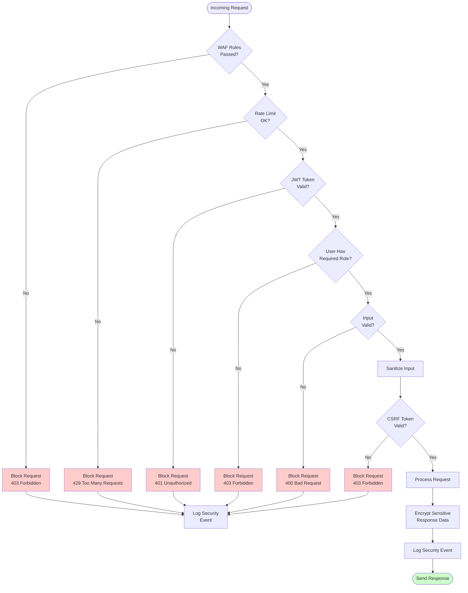
```mermaid
flowchart TD
    Start([Incoming Request]) --> CheckWAF{WAF Rules<br/>Passed?}
    CheckWAF -->|No| Block1[Block Request<br/>403 Forbidden]
    CheckWAF -->|Yes| CheckRate{Rate Limit<br/>OK?}
    
    CheckRate -->|No| Block2[Block Request<br/>429 Too Many Requests]
    CheckRate -->|Yes| CheckAuth{JWT Token<br/>Valid?}
    
    CheckAuth -->|No| Block3[Block Request<br/>401 Unauthorized]
    CheckAuth -->|Yes| CheckRole{User Has<br/>Required Role?}
    
    CheckRole -->|No| Block4[Block Request<br/>403 Forbidden]
    CheckRole -->|Yes| ValidateInput{Input<br/>Valid?}
    
    ValidateInput -->|No| Block5[Block Request<br/>400 Bad Request]
    ValidateInput -->|Yes| Sanitize[Sanitize Input]
    
    Sanitize --> CheckCSRF{CSRF Token<br/>Valid?}
    CheckCSRF -->|No| Block6[Block Request<br/>403 Forbidden]
    CheckCSRF -->|Yes| ProcessReq[Process Request]
    
    ProcessReq --> Encrypt[Encrypt Sensitive<br/>Response Data]
    Encrypt --> AuditLog[Log Security Event]
    AuditLog --> End([Send Response])
    
    Block1 --> LogBlock[Log Security<br/>Event]
    Block2 --> LogBlock
    Block3 --> LogBlock
    Block4 --> LogBlock
    Block5 --> LogBlock
    Block6 --> LogBlock
    
    style Block1 fill:#ffcccc
    style Block2 fill:#ffcccc
    style Block3 fill:#ffcccc
    style Block4 fill:#ffcccc
    style Block5 fill:#ffcccc
    style Block6 fill:#ffcccc
    style End fill:#ccffcc
```

### **8.3 Security Threat Model**

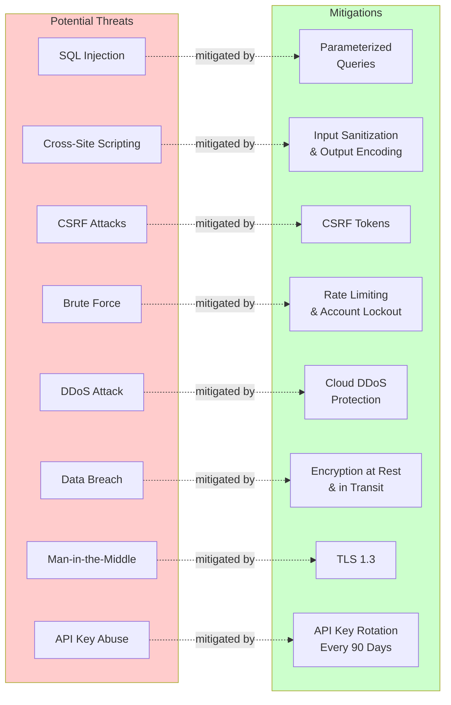
```mermaid
graph LR
    subgraph Threats["Potential Threats"]
        SQL["SQL Injection"]
        XSS["Cross-Site Scripting"]
        CSRF["CSRF Attacks"]
        BruteForce["Brute Force"]
        DDoSAttack["DDoS Attack"]
        DataBreach["Data Breach"]
        MITM["Man-in-the-Middle"]
        APIAbuse["API Key Abuse"]
    end
    
    subgraph Mitigations["Mitigations"]
        ParamQuery["Parameterized<br/>Queries"]
        InputSan["Input Sanitization<br/>& Output Encoding"]
        CSRFToken["CSRF Tokens"]
        RateLimit2["Rate Limiting<br/>& Account Lockout"]
        CloudDDoS["Cloud DDoS<br/>Protection"]
        Encryption["Encryption at Rest<br/>& in Transit"]
        TLS["TLS 1.3"]
        KeyRotation["API Key Rotation<br/>Every 90 Days"]
    end
    
    SQL -.mitigated by.-> ParamQuery
    XSS -.mitigated by.-> InputSan
    CSRF -.mitigated by.-> CSRFToken
    BruteForce -.mitigated by.-> RateLimit2
    DDoSAttack -.mitigated by.-> CloudDDoS
    DataBreach -.mitigated by.-> Encryption
    MITM -.mitigated by.-> TLS
    APIAbuse -.mitigated by.-> KeyRotation
    
    style Threats fill:#ffcccc
    style Mitigations fill:#ccffcc
```

### **8.4 Data Protection Flow**

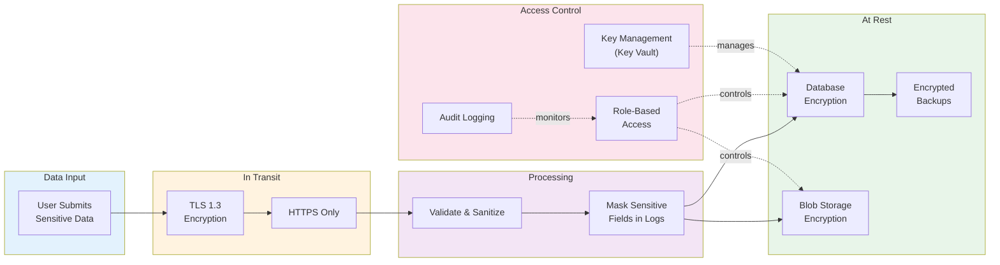
```mermaid
flowchart LR
    subgraph Input["Data Input"]
        UserData["User Submits<br/>Sensitive Data"]
    end
    
    subgraph Transit["In Transit"]
        TLS1["TLS 1.3<br/>Encryption"]
        HTTPS1["HTTPS Only"]
    end
    
    subgraph Processing["Processing"]
        Validate["Validate & Sanitize"]
        Mask["Mask Sensitive<br/>Fields in Logs"]
    end
    
    subgraph Storage["At Rest"]
        DBEncrypt["Database<br/>Encryption"]
        BlobEncrypt["Blob Storage<br/>Encryption"]
        BackupEncrypt["Encrypted<br/>Backups"]
    end
    
    subgraph Access["Access Control"]
        RBAC2["Role-Based<br/>Access"]
        Audit["Audit Logging"]
        KeyMgmt["Key Management<br/>(Key Vault)"]
    end
    
    UserData --> TLS1
    TLS1 --> HTTPS1
    HTTPS1 --> Validate
    Validate --> Mask
    Mask --> DBEncrypt
    Mask --> BlobEncrypt
    DBEncrypt --> BackupEncrypt
    
    RBAC2 -.controls.-> DBEncrypt
    RBAC2 -.controls.-> BlobEncrypt
    Audit -.monitors.-> RBAC2
    KeyMgmt -.manages.-> DBEncrypt
    
    style Input fill:#e3f2fd
    style Transit fill:#fff3e0
    style Processing fill:#f3e5f5
    style Storage fill:#e8f5e9
    style Access fill:#fce4ec
```

### **8.5 Secrets Management Architecture**

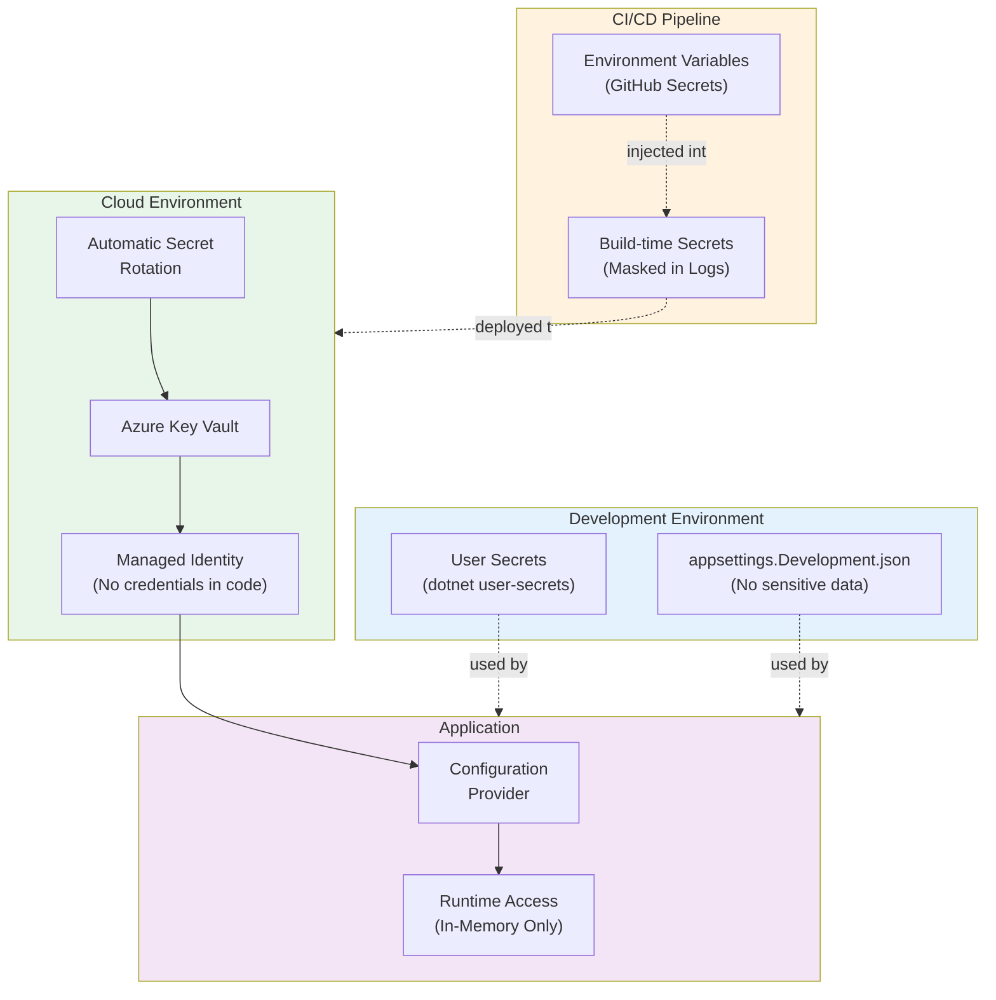
```mermaid
graph TB
    subgraph DevEnv["Development Environment"]
        DevSecrets["User Secrets<br/>(dotnet user-secrets)"]
        LocalConfig["appsettings.Development.json<br/>(No sensitive data)"]
    end
    
    subgraph CI_CD["CI/CD Pipeline"]
        EnvVars["Environment Variables<br/>(GitHub Secrets)"]
        BuildSecrets["Build-time Secrets<br/>(Masked in Logs)"]
    end
    
    subgraph Cloud["Cloud Environment"]
        KeyVault2["Azure Key Vault"]
        ManagedIdentity["Managed Identity<br/>(No credentials in code)"]
        SecretRotation["Automatic Secret<br/>Rotation"]
    end
    
    subgraph App["Application"]
        Config["Configuration<br/>Provider"]
        Runtime["Runtime Access<br/>(In-Memory Only)"]
    end
    
    DevSecrets -.used by.-> App
    LocalConfig -.used by.-> App
    
    EnvVars -.injected into.-> BuildSecrets
    BuildSecrets -.deployed to.-> Cloud
    
    KeyVault2 --> ManagedIdentity
    ManagedIdentity --> Config
    SecretRotation --> KeyVault2
    Config --> Runtime
    
    style DevEnv fill:#e3f2fd
    style CI_CD fill:#fff3e0
    style Cloud fill:#e8f5e9
    style App fill:#f3e5f5
```


### **8.6 Security Monitoring Dashboard**

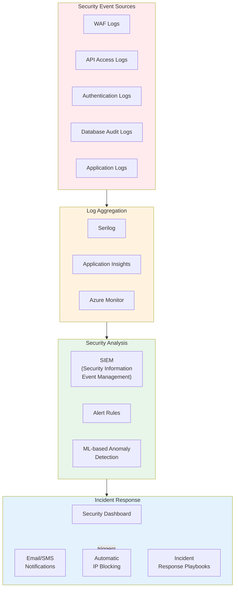
```mermaid
graph TB
    subgraph Sources["Security Event Sources"]
        WAFLogs["WAF Logs"]
        APILogs["API Access Logs"]
        AuthLogs["Authentication Logs"]
        DBLogs["Database Audit Logs"]
        AppLogs["Application Logs"]
    end
    
    subgraph Aggregation["Log Aggregation"]
        Serilog["Serilog"]
        AppInsights2["Application Insights"]
        AzureMonitor["Azure Monitor"]
    end
    
    subgraph Analysis["Security Analysis"]
        SIEM["SIEM<br/>(Security Information<br/>Event Management)"]
        Alerts["Alert Rules"]
        ML["ML-based Anomaly<br/>Detection"]
    end
    
    subgraph Response["Incident Response"]
        Dashboard["Security Dashboard"]
        Notifications["Email/SMS<br/>Notifications"]
        AutoBlock["Automatic<br/>IP Blocking"]
        Playbooks["Incident<br/>Response Playbooks"]
    end
    
    Sources --> Aggregation
    Aggregation --> Analysis
    Analysis --> Response
    
    Response -.triggers.-> AutoBlock
    
    style Sources fill:#ffebee
    style Aggregation fill:#fff3e0
    style Analysis fill:#e8f5e9
    style Response fill:#e3f2fd
```

### **8.7 Compliance and Audit Trail**

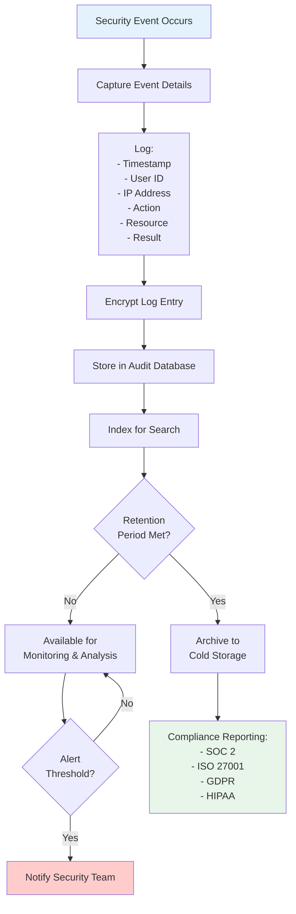
```mermaid
flowchart TD
    Event[Security Event Occurs] --> Capture[Capture Event Details]
    
    Capture --> LogDetails[Log:<br/>- Timestamp<br/>- User ID<br/>- IP Address<br/>- Action<br/>- Resource<br/>- Result]
    
    LogDetails --> Encrypt2[Encrypt Log Entry]
    Encrypt2 --> Store[Store in Audit Database]
    
    Store --> Index[Index for Search]
    Index --> Retention{Retention<br/>Period Met?}
    
    Retention -->|No| Monitor[Available for<br/>Monitoring & Analysis]
    Retention -->|Yes| Archive[Archive to<br/>Cold Storage]
    
    Monitor --> Alert2{Alert<br/>Threshold?}
    Alert2 -->|Yes| Notify[Notify Security Team]
    Alert2 -->|No| Monitor
    
    Archive --> Compliance2[Compliance Reporting:<br/>- SOC 2<br/>- ISO 27001<br/>- GDPR<br/>- HIPAA]
    
    style Event fill:#e3f2fd
    style Notify fill:#ffcccc
    style Compliance2 fill:#e8f5e9
```

### **8.8 Authentication Flow**

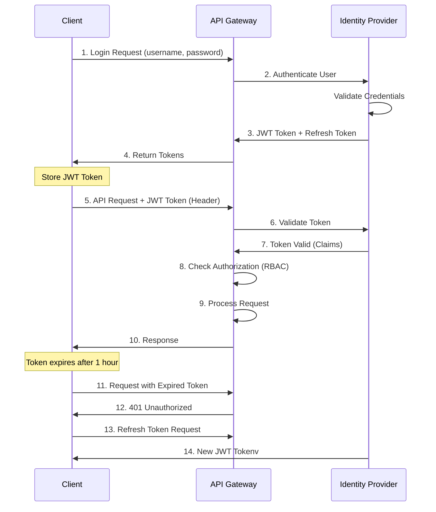
```mermaid
sequenceDiagram
    participant Client
    participant API as API Gateway
    participant IdP as Identity Provider
    
    Client->>API: 1. Login Request (username, password)
    API->>IdP: 2. Authenticate User
    IdP->>IdP: Validate Credentials
    IdP->>API: 3. JWT Token + Refresh Token
    API->>Client: 4. Return Tokens
    
    Note over Client: Store JWT Token
    
    Client->>API: 5. API Request + JWT Token (Header)
    API->>IdP: 6. Validate Token
    IdP->>API: 7. Token Valid (Claims)
    API->>API: 8. Check Authorization (RBAC)
    API->>API: 9. Process Request
    API->>Client: 10. Response
    
    Note over Client: Token expires after 1 hour
    
    Client->>API: 11. Request with Expired Token
    API->>Client: 12. 401 Unauthorized
    Client->>API: 13. Refresh Token Request
    IdP->>Client: 14. New JWT Tokenv
```

### **8.9 Role-Based Access Control**

| Role | Permissions |
|------|-------------|
| **Admin** | Full access to all contexts, can manage users |
| **Developer** | Create/update forms, generate code, view history |
| **Designer** | Upload PDFs, approve candidates, view forms |
| **Viewer** | Read-only access to forms and generated code |

### **8.10 Security Best Practices Implemented**

- [ ] All API endpoints require authentication
- [ ] JWT tokens expire after 1 hour
- [ ] Refresh tokens for extended sessions
- [ ] Password hashing with BCrypt (min 12 rounds)
- [ ] SQL injection prevention via parameterized queries
- [ ] XSS prevention via input sanitization
- [ ] CSRF tokens for state-changing operations
- [ ] Rate limiting: 100 requests/minute per user
- [ ] File upload validation (type, size, malware scan)
- [ ] Secure headers (HSTS, CSP, X-Frame-Options)
- [ ] API key rotation every 90 days
- [ ] Audit logging of all sensitive operations

---

## **9. Deployment Architecture**

### **9.1 Cloud Deployment (Azure)**

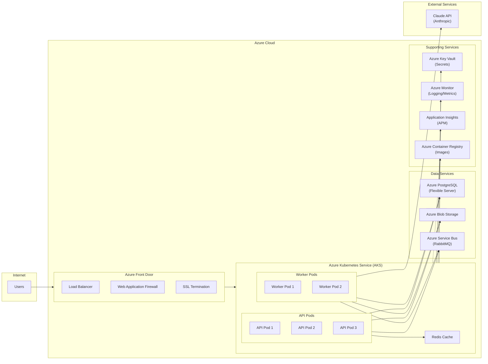
```mermaid
graph LR
    subgraph Internet["Internet"]
        Users["Users"]
    end
    
    subgraph Azure["Azure Cloud"]
        subgraph FrontDoor["Azure Front Door"]
            LB["Load Balancer"]
            WAF["Web Application Firewall"]
            SSL["SSL Termination"]
        end
        
        subgraph AKS["Azure Kubernetes Service (AKS)"]
            subgraph APIPods["API Pods"]
                API1["API Pod 1"]
                API2["API Pod 2"]
                API3["API Pod 3"]
            end
            
            subgraph WorkerPods["Worker Pods"]
                Worker1["Worker Pod 1"]
                Worker2["Worker Pod 2"]
            end
            
            Redis["Redis Cache"]
        end
        
        subgraph DataServices["Data Services"]
            PostgreSQL["Azure PostgreSQL<br/>(Flexible Server)"]
            BlobStorage["Azure Blob Storage"]
            ServiceBus["Azure Service Bus<br/>(RabbitMQ)"]
        end
        
        subgraph Support["Supporting Services"]
            KeyVault["Azure Key Vault<br/>(Secrets)"]
            Monitor["Azure Monitor<br/>(Logging/Metrics)"]
            AppInsights["Application Insights<br/>(APM)"]
            ACR["Azure Container Registry<br/>(Images)"]
        end
    end
    
    subgraph External["External Services"]
        ClaudeAPI["Claude API<br/>(Anthropic)"]
    end
    
    Users --> FrontDoor
    FrontDoor --> AKS
    
    APIPods --> Redis
    APIPods --> PostgreSQL
    APIPods --> BlobStorage
    APIPods --> ServiceBus
    
    WorkerPods --> PostgreSQL
    WorkerPods --> BlobStorage
    WorkerPods --> ServiceBus
    WorkerPods --> ClaudeAPI
    
    AKS --> KeyVault
    AKS --> Monitor
    AKS --> AppInsights
    AKS -.pulls images.-> ACR
```

### **9.2 Environment Strategy**

#### **9.2.1 Environment Pipeline**
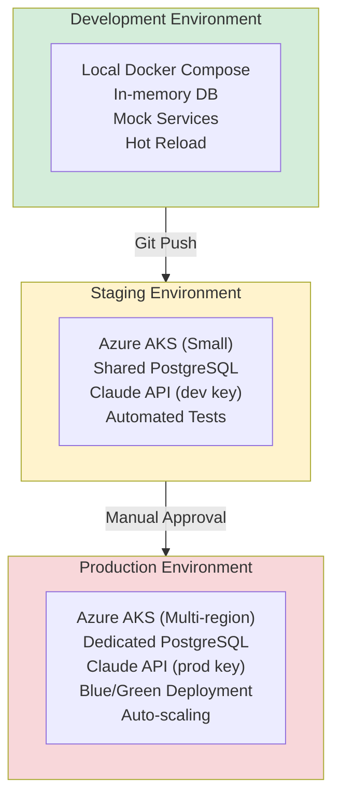
```mermaid
graph TD
    subgraph Development["Development Environment"]
        DevEnv["Local Docker Compose<br/>In-memory DB<br/>Mock Services<br/>Hot Reload"]
    end
    
    subgraph Staging["Staging Environment"]
        StagingEnv["Azure AKS (Small)<br/>Shared PostgreSQL<br/>Claude API (dev key)<br/>Automated Tests"]
    end
    
    subgraph Production["Production Environment"]
        ProdEnv["Azure AKS (Multi-region)<br/>Dedicated PostgreSQL<br/>Claude API (prod key)<br/>Blue/Green Deployment<br/>Auto-scaling"]
    end
    
    Development -->|Git Push| Staging
    Staging -->|Manual Approval| Production
    
    style Development fill:#d4edda
    style Staging fill:#fff3cd
    style Production fill:#f8d7da
```

#### **9.2.2 CI/CD Pipeline Flow**

```mermaid
graph LR
    subgraph Developer["Developer"]
        Dev["Developer<br/>Commits Code"]
    end
    
    subgraph GitRepo["Git Repository"]
        GitHub["GitHub/Azure DevOps"]
    end
    
    subgraph CI["Continuous Integration"]
        Build["Build"]
        UnitTest["Unit Tests"]
        IntTest["Integration Tests"]
        CodeQuality["Code Quality<br/>(SonarQube)"]
        Security["Security Scan<br/>(Snyk/Trivy)"]
    end
    
    subgraph CD["Continuous Deployment"]
        Docker["Build Docker Image"]
        Push["Push to Registry"]
        DeployStaging["Deploy to Staging"]
        SmokeTest["Smoke Tests"]
        Approval["Manual Approval"]
        DeployProd["Deploy to Production"]
    end
    
    Dev --> GitHub
    GitHub --> Build
    Build --> UnitTest
    UnitTest --> IntTest
    IntTest --> CodeQuality
    CodeQuality --> Security
    Security --> Docker
    Docker --> Push
    Push --> DeployStaging
    DeployStaging --> SmokeTest
    SmokeTest --> Approval
    Approval --> DeployProd
```

### **9.3 Scaling Strategy**


|   Component       │ Min │ Max │ Scale Trigger |
| --------------- | ------ | ------- | ---------------- |
| API Pods         │  3  │ 20  │ CPU \> 70% or Memory \> 80%
Worker Pods        │  2  │ 10  │ Queue depth \> 50
PostgreSQL         │  -  │  -  │ Vertical scaling as needed
Redis Cache        │  1  │  3  │ Memory \> 80%
Blob Storage       │  -  │  -  │ Auto-scales
Service Bus        │  -  │  -  │ Auto-scales


### **9.4 Disaster Recovery**

- **RTO (Recovery Time Objective):** 4 hours
- **RPO (Recovery Point Objective):** 15 minutes

**Backup Strategy:**
- Database: Automated backups every 6 hours, retained for 30 days
- Blob Storage: Geo-redundant storage (GRS)
- Configuration: Stored in Git, versioned

**Recovery Procedures:**
1. Database restore from latest backup
2. Deploy latest container images
3. Restore configuration from Key Vault
4. Validate all services operational
5. Resume operations

---

## **10. Non-Functional Requirements**

### **10.1 Performance Requirements**

| Metric                   | Target         | Measurement                      |
| ------------------------ | -------------- | -------------------------------- |
| **API Response Time**    | \< 200ms (p95) | Median response for GET requests |
| **Code Generation Time** | 30s - 5 min    | Depends on form complexity       |
| **Concurrent Users**     | 500+           | Simultaneous active users        |
| **File Upload**          | \< 10 seconds  | For PDFs up to 10MB              |
| **Download Speed**       | \> 10 MB/s     | ZIP file download                |
| **Database Queries**     | \< 100ms (p95) | Simple CRUD operations           |

### **10.2 Availability Requirements**

- **Uptime SLA:** 99.9% (\< 8.76 hours downtime/year)
- **Scheduled Maintenance:** Monthly, 2-hour window
- **Monitoring:** 24/7 automated monitoring
- **Incident Response:** \< 15 minutes to acknowledge, \< 4 hours to resolve

### **10.3 Scalability Requirements**

- **Horizontal Scaling:** Auto-scale from 3 to 20 pods
- **Database Connections:** Support 200+ concurrent connections
- **Storage:** Unlimited (cloud-based)
- **Generation Queue:** Handle 1000+ jobs in queue

### **10.4 Reliability Requirements**

- **Data Durability:** 99.999999999% (11 nines)
- **Error Rate:** \< 0.1% of requests
- **Failed Jobs:** \< 5% failure rate
- **Retry Logic:** 3 attempts with exponential backoff

### **10.5 Maintainability Requirements**

- **Code Coverage:** \> 80% test coverage
- **Documentation:** All public APIs documented
- **Logging:** Structured logging for all operations
- **Monitoring:** Health checks every 30 seconds
- **Deployment:** Zero-downtime deployments

---

## **11. Future Enhancements**

### **11.1 Phase 2 Features**

#### **Multi-Language Support**
- Generate code in additional languages: Java, Python, TypeScript
- Support for multiple frameworks: Spring Boot, Django, NestJS

#### **Advanced Template Customization**
- User-defined templates
- Template marketplace
- Template versioning

#### **Enhanced AI Capabilities**
- Form field type inference improvement
- Business rule extraction from PDFs
- Automatic validation rule generation

#### **Collaborative Features**
- Team workspaces
- Shared form libraries
- Code review workflows

### **11.2 Phase 3 Features**

#### **No-Code Form Builder**
- Visual form designer
- Drag-and-drop interface
- Real-time preview

#### **Integration Plugins**
- Direct GitHub/GitLab integration
- Azure DevOps work item creation
- Jira ticket generation

#### **Analytics & Insights**
- Form complexity analysis
- Code quality metrics
- Usage analytics dashboard

#### **Enterprise Features**
- Multi-tenancy
- Custom branding
- SSO/SAML support
- Advanced RBAC

---

## **Appendix A: Glossary**

| Term                | Definition                                                           |
| ------------------- | -------------------------------------------------------------------- |
| **Aggregate**       | A cluster of domain objects treated as a single unit                 |
| **Bounded Context** | An explicit boundary within which a domain model is defined          |
| **CQRS**            | Command Query Responsibility Segregation pattern                     |
| **Domain Event**    | Something that happened in the domain that domain experts care about |
| **Entity**          | An object with a distinct identity that persists over time           |
| **Repository**      | Encapsulates data access logic                                       |
| **Value Object**    | An immutable object defined by its attributes                        |

---

## **Appendix B: References**

- **Domain-Driven Design:** Eric Evans, "Domain-Driven Design: Tackling Complexity in the Heart of Software"
- **Clean Architecture:** Robert C. Martin, "Clean Architecture: A Craftsman's Guide to Software Structure"
- **Anthropic API Documentation:** https://docs.anthropic.com/
- **ASP.NET Core Documentation:** https://docs.microsoft.com/aspnet/core
- **Entity Framework Core:** https://docs.microsoft.com/ef/core

---

## **Document Control**

| Version | Date     | Author            | Changes       |
| ------- | -------- | ----------------- | ------------- |
| 1.0     | Dec 2024 | Architecture Team | Initial draft |

**Approval:**
- [ ](#) Technical Lead
- [ ](#) Security Team
- [ ](#) DevOps Team
- [ ](#) Product Owner

---
